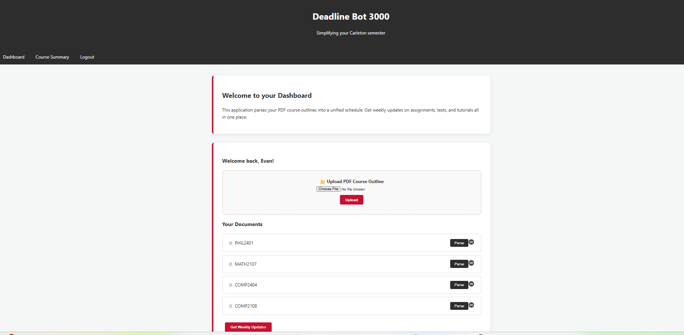
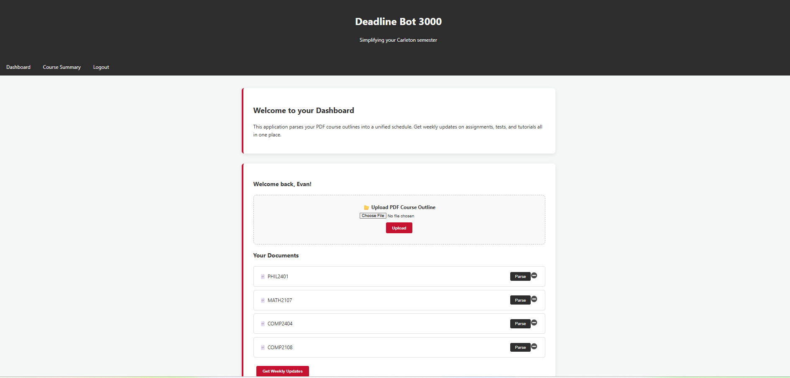

# DEADLINE BOT

Tired of constantly having to reopen course outlines to remember when that one assignment is due?

Look no more than Deadline Bot.

Deadline Bot sends weekly updates and foresight on all your deadlines (tests, quizzes, exams, assignments, tutorials, and more).

All you need to do is create an account, then upload your course outlines once. Simple.

## What the project does

<<<<<<< HEAD

Not 100% done yet, server will be available to use when completed
=======
- Lets students upload course outline PDFs.
- Extracts important dates and course details from those documents.
- Builds a structured course summary with deadlines.
- Supports weekly email reminders based on extracted deadlines.
- Tracks summary progress (processing, completed, failed) so users can retry when needed.

## Packages used

### Node.js packages

- express
- express-session
- connect-mongo
- mongoose
- mongodb
- multer
- bcrypt
- node-cron
- pug
- nodemon

### Python packages

- openai
- pymongo
- bson
- python-dotenv

## Demo pictures

>>>>>>> 0839f29 (Refactored entire server)
